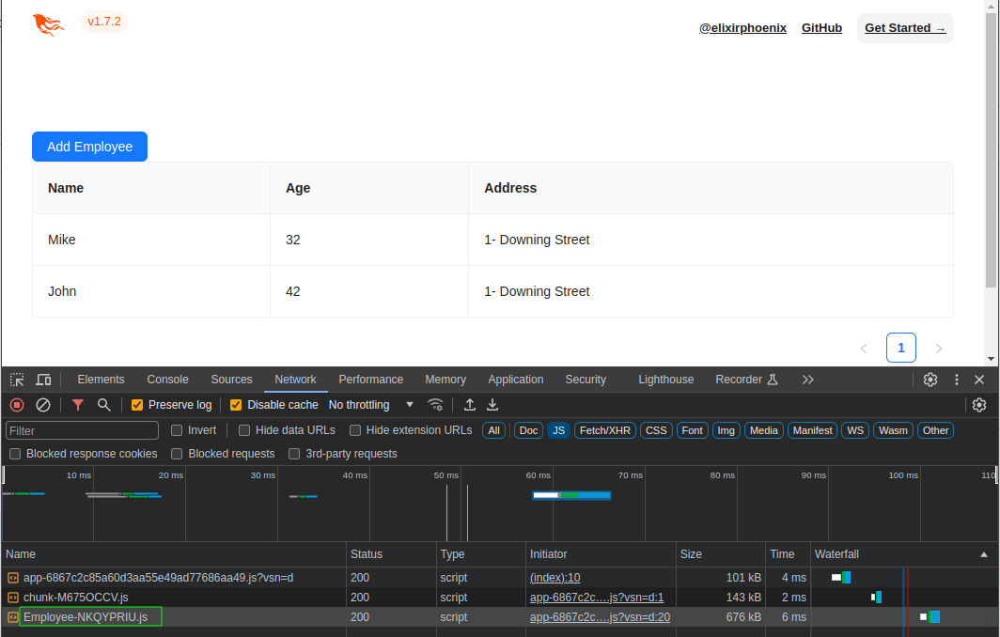

# Phoenix Liveview + React 18 + Antd



To start your Phoenix server:

- Run `mix setup` to install and setup dependencies
- Start Phoenix endpoint with `mix phx.server` or inside IEx with `iex -S mix phx.server`

Now you can visit [`localhost:4000`](http://localhost:4000) from your browser.

## Container

```bash
./container.sh
# visit http://localhost:4000
```

## References

- https://stephenbussey.com/2022/04/13/react-in-liveview-how-and-why.html
- https://dev.to/ndrean/notes-on-liveview-components-and-js-interactions-22gh
